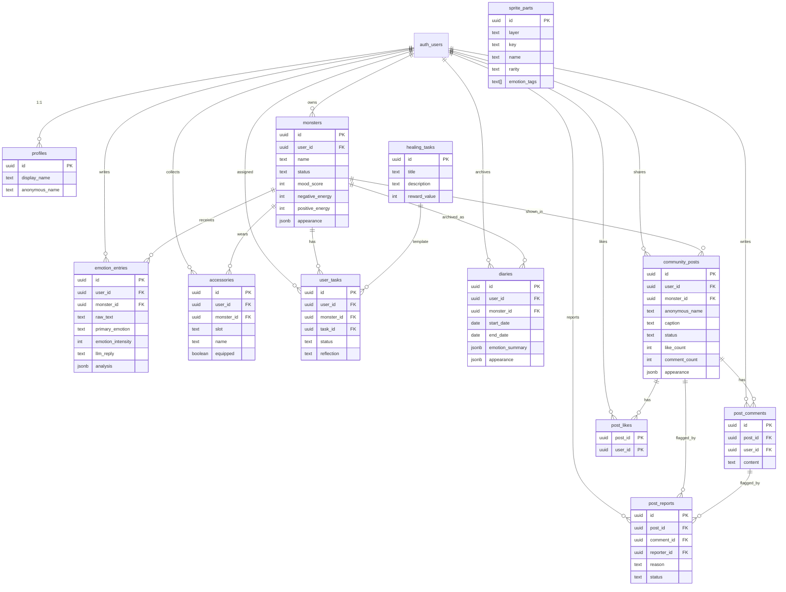

# 🐄 Moomo 沐哞 — 把碎念交給你的小怪獸

> 一個**私密情緒樹洞**：把今天的不爽餵給你的小怪獸，看著牠變化、收集配件、完成治癒任務。


## ✨ 核心功能

| 功能 | 說明 |
|------|------|
| 🗣️ **情緒輸入** | 輸入一段碎碎念，AI 會溫柔接住你的情緒 |
| 🤖 **AI 情緒分析** | 基於 Gemini 2.5 Flash，辨識情緒類別、強度、具象關鍵字 |
| 🎨 **怪獸外觀變化** | 根據情緒結果組合身體顏色、表情、頭飾、手持物、背景 |
| 🎁 **配件收集** | 每次情緒輸入自動獲得與情緒相關的配件 |
| 🌿 **治癒任務** | 根據負面能量自動分配療癒小任務（附完成反思） |
| 📖 **情緒日記** | 封存小哞時保存完整的情緒統計、圖表與 AI 小結 |
| 👥 **匿名社群** | 匿名分享怪獸外觀，留言互相鼓勵（附檢舉與安全機制） |
| 📚 **圖鑑系統** | 收集所有解鎖過的怪獸部件 |
| 🔴 **危機求助** | AI 偵測危機內容時顯示固定求助卡片（1925、119、110、1980） |
| 🔒 **隱私控制** | 刪除單筆紀錄、清空所有紀錄、刪除帳號資料 |

## 🏗️ 技術架構

```
Frontend              Backend / SSR           Database
┌─────────────┐      ┌──────────────┐       ┌─────────────┐
│ React 19    │      │ TanStack     │       │ Supabase    │
│ TanStack    │─────▶│ Start (SSR)  │──────▶│ PostgreSQL  │
│ Router      │      │ Server Fns   │       │ + RLS       │
│ React Query │      │              │       │ + Auth      │
│ Recharts    │      │ Vite 7       │       └─────────────┘
│ Tailwind 4  │      │ Cloudflare   │              │
└─────────────┘      │ Workers      │       ┌──────┴──────┐
                     └──────────────┘       │ Gemini 2.5  │
                                            │ Flash (AI)  │
                                            └─────────────┘
```

| 技術 | 用途 |
|------|------|
| **React 19** | UI 框架 |
| **TanStack Start** | SSR + Server Functions |
| **TanStack Router** | 檔案式路由 |
| **TanStack React Query** | 資料同步與快取 |
| **Vite 7** | 開發伺服器與打包 |
| **Tailwind CSS 4** | 樣式系統 |
| **Supabase** | PostgreSQL + Auth + RLS |
| **Cloudflare Workers** | 部署目標 |
| **Recharts** | 情緒統計圖表 |
| **Zod** | AI 回傳格式驗證 |
| **Sonner** | Toast 通知 |
| **Lucide React** | 圖示 |

## 📊 資料表設計



## 🚀 安裝方式

### 前置需求

- [Node.js](https://nodejs.org/) 20+ 或 [Bun](https://bun.sh/) 1.1+
- [Supabase](https://supabase.com/) 帳號（免費方案即可）

### 步驟

```bash
# 1. Clone 專案
git clone https://github.com/Dannygod/emotional-critter-haven.git
cd emotional-critter-haven

# 2. 建立環境變數
cp .env.example .env
# 然後填入你的 Supabase 連線資訊

# 3. 安裝依賴
bun install
# 或 npm install

# 4. 套用資料庫 Migration
# 方法 A: Supabase CLI
supabase db push

# 方法 B: 手動到 Supabase Dashboard > SQL Editor 依序執行 supabase/migrations/*.sql

# 5. 啟動開發伺服器
bun run dev
# 或 npm run dev
```

## 🔑 環境變數說明

| 變數名稱 | 用途 | 來源 |
|----------|------|------|
| `SUPABASE_URL` | Supabase API URL (SSR) | Supabase Dashboard > Settings > API |
| `SUPABASE_PUBLISHABLE_KEY` | Supabase anon key (SSR) | 同上 |
| `VITE_SUPABASE_URL` | Supabase API URL (Client) | 同上 |
| `VITE_SUPABASE_PUBLISHABLE_KEY` | Supabase anon key (Client) | 同上 |
| `VITE_SUPABASE_PROJECT_ID` | Supabase project ID | Supabase Dashboard > Settings > General |

> **注意**：`VITE_` 前綴的變數會被 Vite 注入到前端 bundle 中。`SUPABASE_PUBLISHABLE_KEY` 是 anon key，本身權限受 RLS 限制，可安全暴露給前端。

## 📁 專案目錄結構

```
emotional-critter-haven/
├── src/
│   ├── components/         # UI 元件
│   │   ├── MonsterSprite.tsx    # 怪獸組合渲染
│   │   ├── CrisisCard.tsx       # 危機求助卡片
│   │   └── ui/                  # shadcn/ui 基礎元件
│   ├── lib/
│   │   ├── emotion/             # 情緒分析模組（拆分後）
│   │   │   ├── ai-analyze.ts        # AI 呼叫與 prompt
│   │   │   ├── ai-schema.ts         # Zod 驗證 schema
│   │   │   ├── appearance-picker.ts # 怪獸外觀組合
│   │   │   ├── mood-calculator.ts   # 情緒分數計算
│   │   │   ├── task-assigner.ts     # 治癒任務分配
│   │   │   ├── safety.ts           # 安全等級常數
│   │   │   └── index.ts            # Server functions 入口
│   │   ├── privacy.functions.ts # 隱私控制 server functions
│   │   ├── auth.tsx             # 認證 context
│   │   └── utils.ts
│   ├── integrations/supabase/   # Supabase 客戶端與型別
│   ├── routes/
│   │   ├── _authenticated/
│   │   │   ├── home.tsx         # 主頁（情緒輸入 + 怪獸）
│   │   │   ├── tasks.tsx        # 治癒任務（附反思）
│   │   │   ├── diary.tsx        # 情緒日記（附圖表）
│   │   │   ├── gallery.tsx      # 部件圖鑑
│   │   │   ├── community.tsx    # 匿名社群（附檢舉）
│   │   │   └── settings.tsx     # 設定（附隱私控制）
│   │   └── ...
│   └── styles.css
├── supabase/
│   └── migrations/              # 資料庫 Migration 檔案
├── .env.example                 # 環境變數範本
├── package.json
├── vite.config.ts
└── README.md
```

## 🔒 安全與隱私

### Row Level Security (RLS)

所有資料表都啟用了 Supabase RLS：

- **個人資料**（monsters, emotion_entries, accessories, user_tasks, diaries）：僅限擁有者讀寫
- **社群貼文**：所有已登入使用者可讀取 `status = 'published'` 的貼文
- **怪獸外觀**：僅擁有者或被公開貼文引用時才可讀取
- **檢舉紀錄**：僅檢舉者本人可讀取自己的檢舉

### 隱私控制

使用者可以在「設定」頁面進行以下操作：

- ✅ 刪除單筆情緒紀錄
- ✅ 清空所有情緒紀錄
- ✅ 刪除全部帳號資料
- ✅ 查看完整隱私說明

### AI 安全

- AI 回傳結果經過 Zod schema 驗證，格式錯誤時拒絕處理
- 偵測到 `self_harm` / `harm_others` / `crisis` 時顯示固定式求助卡片
- 社群分享前有個資與內容提醒 Dialog
- 社群貼文支援檢舉功能

## 📝 授權

本專案為課程作業，僅供學術用途。
